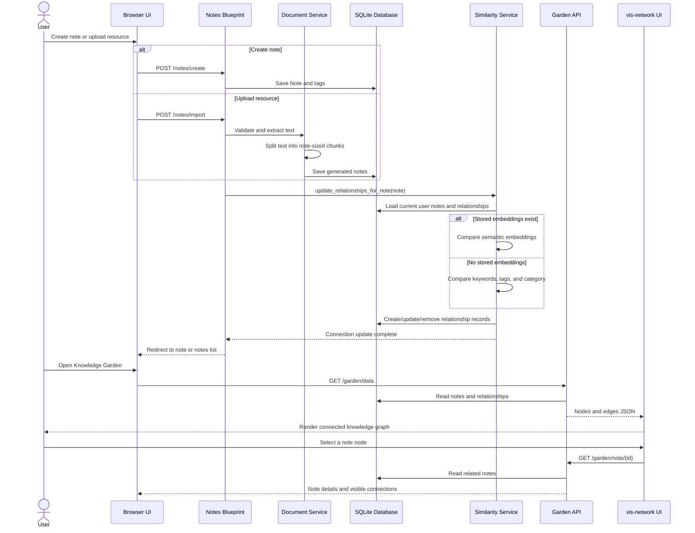

# Thought Garden UML Flows

These diagrams describe the current automatic-connection journey. They are the
baseline for the planned project restructure.

## Activity diagram: capture and connect knowledge

```mermaid
flowchart TD
    start([User opens Thought Garden]) --> choice{Create a note or upload a resource?}

    choice -->|Create note| form[Enter title, content, category, and tags]
    choice -->|Upload resource| validate[Validate PDF, Markdown, or text file]
    validate --> valid{File valid and text extracted?}
    valid -->|No| error[Show validation or extraction error]
    error --> choice
    valid -->|Yes| chunk[Split extracted text into one or more notes]

    form --> save[Save note and tags]
    chunk --> save
    save --> connect[Discover automatic connections]

    connect --> stored{Stored semantic embeddings available?}
    stored -->|Yes| semantic[Score notes with cosine similarity]
    stored -->|No| lightweight[Score notes from keywords, tags, and category]
    semantic --> select[Keep strongest relevant connections]
    lightweight --> select
    select --> update[Create, update, or remove relationship records]
    update --> garden[Load Knowledge Garden data]
    garden --> render[Render notes and visible connection edges]
    render --> inspect[User selects a node to inspect related notes]
    inspect --> end([Connection journey complete])
```

## Sequence diagram: save or import a note



## Restructure invariants

- Saving a note must complete before its connection update starts.
- A connection update must complete before the user is redirected to the Garden.
- Relationship records are the single source of truth for graph edges and note-detail connections.
- Semantic embeddings enrich matching when already available; they must not block note creation or import.
